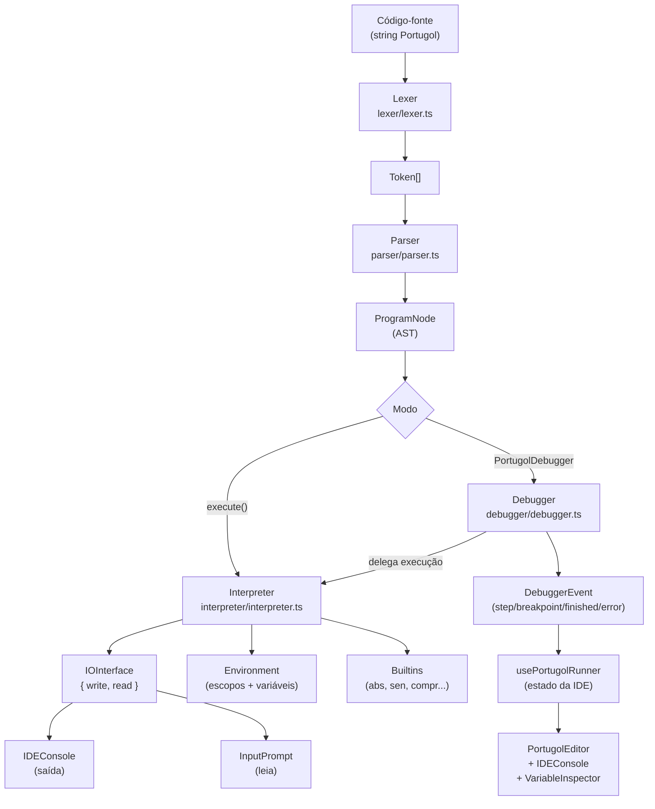

# Arquitetura do IDEALG

Este documento descreve a estrutura técnica e o funcionamento interno do IDEALG.

## Visão Geral

O IDEALG é uma IDE web para Portugol, construída sobre o ecossistema Next.js. O sistema é dividido em dois grandes domínios: o **Motor de Execução** (Interpreter) e a **Interface do Usuário** (IDE).

## Fluxo de Execução

### Descrição das etapas

| Etapa | Arquivo | Responsabilidade |
|---|---|---|
| **Lexer** | `src/lexer/lexer.ts` | Transforma texto em `Token[]` (palavras-chave, identificadores, literais, operadores) |
| **Parser** | `src/parser/parser.ts` | Consome tokens e produz a AST (`ProgramNode`) via descida recursiva |
| **AST** | `src/parser/ast.ts` | Definição de todos os nós da árvore sintática (`StmtNode`, `ExprNode`, etc.) |
| **Interpreter** | `src/interpreter/interpreter.ts` | Tree-walker: percorre a AST e executa cada nó, gerenciando escopos e I/O |
| **Environment** | `src/interpreter/environment.ts` | Pilha de escopos (variáveis, constantes, tipos, sinais de controle) |
| **Builtins** | `src/interpreter/builtins.ts` | Implementação das funções nativas (`abs`, `sen`, `compr`, `aleatorio`, etc.) |
| **Debugger** | `src/debugger/debugger.ts` | Wraper do Interpreter com sistema de eventos, breakpoints e controle passo a passo |

## Componentes Principais

### 1. Portugol Interpreter (`/packages/portugol-interpreter`)
O "coração" do projeto. É um interpretador escrito em TypeScript que realiza:
- **Lexing/Parsing**: Transforma o código Portugol em uma AST (Abstract Syntax Tree).
- **Interpretador**: Executa a AST linha a linha (tree-walking interpreter, sem geração de bytecode).
- **Debugger**: Provê ganchos para pausa, inspeção de variáveis e breakpoints.

### 2. Editor de Código (`/src/components/PortugolEditor.tsx`)
Utiliza o **Monaco Editor** (o mesmo do VS Code) com:
- **Monarch Tokens**: Definição de sintaxe para Portugol.
- **Decorations**: Realce de linha de debug e breakpoints.
- **Autocomplete**: Sugestões baseadas em palavras-chave e snippets de Portugol.

### 3. Sistema de Execução (`/src/lib/usePortugolRunner.ts`)
Um hook customizado que gerencia o ciclo de vida da execução:
- Interfaceia com o interpretador.
- Gerencia o estado do console (saída).
- Lida com entradas do usuário (`leia`) via Promises.
- Controla o estado do debugger (breakpoints, step-into, step-over, continue).
- Persiste projetos no `localStorage`.

## Gerenciamento de Estado

- **Tema**: Centralizado no `ThemeContext`, persiste preferências no `localStorage` e aplica classes CSS no `documentElement`.
- **Projetos**: Gerenciados localmente no `localStorage` (via `usePortugolRunner`), permitindo salvar e carregar múltiplos arquivos.

## Estilização

O projeto utiliza um sistema de **Variáveis CSS** puras (definidas em `globals.css`) para garantir que a UI se adapte dinamicamente ao tema escolhido, evitando o overhead de múltiplas bibliotecas de estilo e garantindo performance premium.
